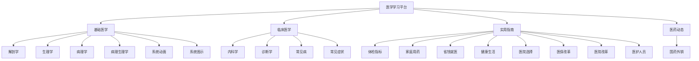
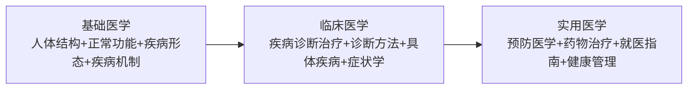
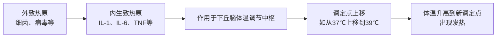
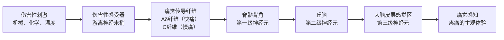
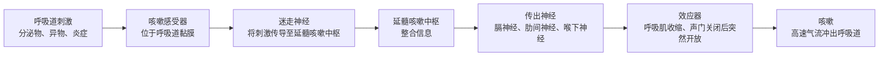
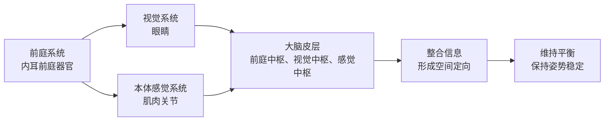
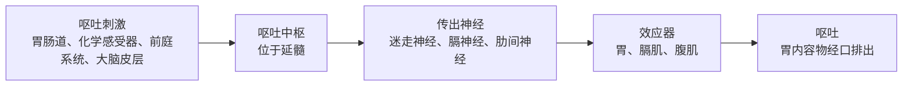
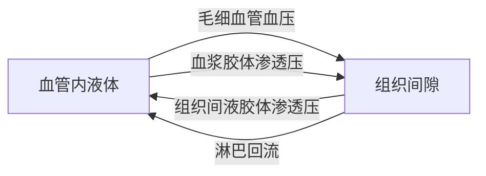

# 医学知识学习平台：从基础到实践，全面了解人体健康

## 前言

医学是一门博大精深的学科，它不仅关系到我们每个人的健康，更是人类文明的重要组成部分。然而，复杂的医学术语和繁多的知识点常常让普通读者望而却步。今天，我们将为您介绍一个全面、系统的医学知识学习平台，它通过可视化的方式、清晰的结构和实用的指南，让医学知识变得通俗易懂、触手可及。

这个平台涵盖了从基础医学到临床医学、从理论知识到实用指南的完整知识体系，适合医学学生、普通大众、医护人员以及健康管理者和教育者使用。让我们一起来探索这个医学知识的宝库吧！

## 一、平台整体架构：从基础到实践的完整知识链

这个医学学习平台的内容架构非常清晰，按照知识的逻辑关系分为四大板块：

这个知识体系的逻辑关系可以概括为：

从正常人体结构功能（解剖、生理）到异常病理变化（病理、病理生理），再到临床疾病诊疗（内科、诊断、常见病、症状），最后到实用应用指南（体检、用药、就医、健康生活），形成了一个从理论到实践、从预防到治疗的完整知识链条。

## 二、基础医学：了解人体的结构与功能

### 2.1 解剖学：人体结构的奥秘

解剖学是医学的基石，它研究人体的正常形态结构。该平台详细介绍了人体八大系统：

#### 运动系统
运动系统由206块骨骼、关节系统和600余块骨骼肌组成，构成了人体的支架和运动的基础。骨骼不仅是身体的支撑框架，还参与造血和钙磷代谢。关节连接骨骼，使人体能够进行各种复杂的运动。骨骼肌通过收缩和舒张，带动骨骼产生运动。

#### 消化系统
消化系统包括消化道和消化腺两大部分。消化道从口腔开始，经过食管、胃、小肠（十二指肠、空肠、回肠）、大肠（盲肠、结肠、直肠），最后到肛门，全长约8-10米。消化腺包括唾液腺、肝脏、胰腺等，分泌消化液帮助食物消化吸收。

#### 呼吸系统
呼吸系统分为上呼吸道（鼻、咽、喉）和下呼吸道（气管、支气管、肺）。肺泡是气体交换的基本单位，成人两肺约有3-4亿个肺泡，总表面积可达70-100平方米，为氧气和二氧化碳的交换提供了巨大的表面积。

#### 泌尿系统
泌尿系统由肾脏、输尿管、膀胱和尿道组成。肾脏是人体的"净水器"，每个肾脏由约100万个肾单位组成，负责过滤血液、生成尿液、调节体液平衡和电解质平衡。

#### 生殖系统
男性生殖系统包括睾丸、附睾、输精管、前列腺、精囊腺等。女性生殖系统包括卵巢、输卵管、子宫、阴道等。生殖系统不仅负责繁衍后代，还分泌性激素，调节人体的第二性征和生殖功能。

#### 心血管系统
心血管系统由心脏和血管组成。心脏是一个强有力的泵，有四个腔室（左心房、右心房、左心室、右心室），每天跳动约10万次，泵出约8000升血液。血管分为动脉、毛细血管和静脉，形成封闭的循环系统，将血液输送到全身各个组织器官。

#### 淋巴系统
淋巴系统包括淋巴管道、淋巴器官（淋巴结、脾、胸腺）和淋巴组织。它是人体的免疫防御系统的重要组成部分，负责过滤淋巴液、产生淋巴细胞、参与免疫应答。

#### 神经系统
神经系统分为中枢神经系统（脑、脊髓）和周围神经系统（脑神经、脊神经）。脑由大脑、小脑、脑干组成，是人体的指挥中心，负责意识、思维、记忆、运动控制、感觉整合等高级功能。脊髓是脑与身体之间的信息高速公路。

### 2.2 生理学：人体功能的运作机制

生理学研究人体各器官系统的正常功能和活动规律。该平台详细阐述了八大生理过程：

#### 细胞功能
细胞是人体的基本结构和功能单位。物质转运包括被动转运（扩散、渗透、滤过）和主动转运（需要消耗能量）。生物电现象是细胞功能的重要表现形式，静息电位（-90mV）和动作电位（+30mV）是神经传导和肌肉收缩的基础。

#### 血液
血液由血浆（55%）和血细胞（45%）组成。血浆中含有水分、蛋白质、电解质、营养物质等。血细胞包括红细胞（运输氧气）、白细胞（免疫防御）和血小板（止血）。生理性止血包括血管收缩、血小板血栓形成和血液凝固三个过程。

#### 血液循环
心动周期约0.8秒，包括心房收缩、心室收缩和全心舒张三个时期。心输出量约为5-6升/分钟，是衡量心脏泵血功能的重要指标。心脏传导系统包括窦房结、房室结、希氏束、浦肯野纤维，控制着心脏的节律性跳动。

#### 呼吸
呼吸过程包括肺通气（气体进出肺）、肺换气（肺泡与血液之间气体交换）、气体运输（氧气和二氧化碳在血液中的运输）和组织换气（血液与组织细胞之间气体交换）。呼吸受中枢化学感受器（对CO₂敏感）和外周化学感受器（对O₂和CO₂敏感）的调节。

#### 消化吸收
消化液包括唾液（含淀粉酶）、胃液（含胃蛋白酶和盐酸）、胰液（含多种消化酶）、胆汁（乳化脂肪）等。食物的吸收主要在小肠进行，小肠绒毛大大增加了吸收面积。

#### 尿生成
尿生成包括肾小球滤过（GFR=125ml/min）、肾小管重吸收（99%的水分被重吸收）和肾小管分泌三个过程。肾脏通过调节尿量和尿成分，维持体内水、电解质和酸碱平衡。

#### 神经系统
反射弧是神经反射的基本结构，包括感受器→传入神经→神经中枢→传出神经→效应器五个部分。条件反射是通过后天学习和训练形成的，如望梅止渴。

#### 内分泌
内分泌系统通过激素调节人体各种生理功能。下丘脑-垂体-靶腺轴是内分泌调节的核心，包括下丘脑-垂体-甲状腺轴、下丘脑-垂体-肾上腺皮质轴、下丘脑-垂体-性腺轴等。

#### 生殖
男性生殖功能包括精子产生、雄激素分泌和性功能。女性生殖功能包括卵子产生、雌激素和孕激素分泌、月经周期、妊娠和分娩。

### 2.3 病理学：疾病形态学的变化

病理学研究疾病的形态学变化，是连接基础医学和临床医学的桥梁。该平台介绍了八大病理过程：

#### 细胞和组织损伤与修复
细胞和组织的适应包括萎缩（体积缩小）、肥大（体积增大）、增生（数量增多）、化生（一种组织转化为另一种组织）。损伤包括变性（可逆性损伤）和坏死（不可逆性损伤）。修复包括再生（同类细胞修复）和纤维性修复（瘢痕形成）。

#### 局部血液循环障碍
充血是指器官或组织内血液含量增多，分为动脉性充血和静脉性充血。出血是指血液从血管腔内流出血管外。血栓形成是指在活体的心、血管内血液发生凝固或血液中某些有形成分析出、凝集形成固体质块的过程。栓塞是指循环血液中出现不溶于血液的异常物质，随血流运行阻塞血管腔的现象。梗死是指器官或局部组织由于血管阻塞、血流停止导致缺氧而发生的坏死。

#### 炎症
炎症是机体对致炎因子引起的损伤所发生的以防御为主的反应，包括变质（细胞变性和坏死）、渗出（液体和细胞渗出）、增生（实质细胞和间质细胞增生）。急性炎症起病急、病程短、以渗出和变质为主。慢性炎症起病慢、病程长、以增生为主。

#### 肿瘤
肿瘤是机体在各种致瘤因素作用下，局部组织细胞异常增生而形成的新生物。肿瘤具有异型性（形态结构和功能与正常组织不同）、相对自主性生长、可转移等特点。良性肿瘤生长缓慢、边界清楚、不转移。恶性肿瘤生长迅速、边界不清、易转移。

#### 动脉粥样硬化
动脉粥样硬化是动脉壁上沉积脂质斑块，导致血管狭窄和硬化的疾病。病变发展过程：脂纹→纤维斑块→粥样斑块→复合病变（斑块出血、溃疡、血栓形成）。

#### 肺炎
肺炎是指肺组织的炎症。大叶性肺炎分为充血水肿期、红色肝样变期、灰色肝样变期、溶解消散期四期。小叶性肺炎以细支气管为中心，肺小叶为单位。间质性肺炎以肺间质炎症为主。

#### 肝硬化
肝硬化是各种慢性肝病发展的晚期阶段，肝细胞广泛坏死、残存肝细胞结节性再生、纤维组织增生、假小叶形成。临床表现为门静脉高压（腹水、脾大、侧支循环建立）和肝功能衰竭（黄疸、出血倾向、肝性脑病）。

#### 肾小球肾炎
肾小球肾炎是变态反应性疾病，导致肾小球损伤。临床表现为蛋白尿、血尿、水肿、高血压，严重者可发展为肾衰竭。

### 2.4 病理生理学：疾病的发生机制

病理生理学研究疾病发生发展的规律和机制。该平台详细介绍了八大疾病机制：

#### 疾病概论
疾病是在一定病因作用下，机体自稳调节紊乱导致的异常生命活动过程。病因包括生物性因素、物理性因素、化学性因素、营养性因素、遗传性因素、免疫性因素、心理社会因素等。发病规律包括损伤与抗损伤、因果交替、局部与整体。

#### 水、电解质代谢紊乱
脱水是指体液容量减少，分为高渗性脱水（失水＞失钠）、等渗性脱水（失水≈失钠）、低渗性脱水（失水＜失钠）。钾代谢紊乱包括低钾血症（血清钾＜3.5mmol/L）和髙钾血症（血清钾＞5.5mmol/L）。

#### 酸碱平衡紊乱
正常血液pH值为7.35-7.45。机体通过血液缓冲系统（碳酸氢盐缓冲系统、磷酸盐缓冲系统、蛋白质缓冲系统）、肺调节（排出CO₂）、肾调节（排出H⁺、重吸收HCO₃⁻）维持酸碱平衡。单纯型酸碱紊乱包括代谢性酸中毒、代谢性碱中毒、呼吸性酸中毒、呼吸性碱中毒四种。

#### 缺氧
缺氧是指组织供氧不足或利用氧障碍。缺氧分为四种类型：低张性缺氧（动脉血氧分压降低，如高山病）、血液性缺氧（血红蛋白量或质异常，如贫血）、循环性缺氧（组织血流减少，如休克）、组织性缺氧（组织利用氧障碍，如氰化物中毒）。

#### 发热
发热是指致热原作用下，体温调节中枢的调定点上移，导致体温升高。机制：外致热原（细菌、病毒等）→内生致热原（IL-1、IL-6、TNF等）→作用于下丘脑体温调节中枢→调定点上移→体温升高。

#### 应激
应激是指机体在受到各种强烈刺激（应激原）时，出现的全身性非特异性适应反应。应激反应包括蓝斑-交感-肾上腺髓质轴（儿茶酚胺分泌增加）和下丘脑-垂体-肾上腺皮质轴（糖皮质激素分泌增加）。

#### DIC（弥散性血管内凝血）
DIC是多种致病因素激活凝血系统，导致全身微血栓形成、凝血因子和血小板大量消耗、继发性纤溶亢进的病理过程。分为三期：高凝期（微血栓形成）→消耗性低凝期（出血）→继发性纤溶亢进期（严重出血）。

#### 休克
休克是指各种致病因素引起的有效循环血量急剧减少，导致组织微循环灌注严重不足，细胞代谢紊乱和器官功能受损的病理过程。分期：缺血性缺氧期（代偿期，微循环收缩）→淤血性缺氧期（失代偿期，微循环扩张）→难治期（微循环衰竭，多器官功能障碍）。

## 三、临床医学：疾病的诊断与治疗

### 3.1 内科学：常见系统疾病

内科学是临床医学的重要分支，主要研究各系统疾病的诊断和治疗。该平台详细介绍了四大系统疾病：

#### 呼吸系统疾病
- **COPD（慢性阻塞性肺疾病）**：慢性支气管炎和肺气肿的统称，主要表现为气流受限不完全可逆。诊断要点：吸烟史、慢性咳嗽咳痰、气短、肺功能检查（FEV₁/FVC＜70%）。治疗原则：戒烟、支气管扩张剂、糖皮质激素、氧疗。

- **支气管哮喘**：气道慢性炎症性疾病，气道高反应性，可逆性气流受限。诊断要点：反复发作的喘息、气急、胸闷、咳嗽，夜间和凌晨发作或加重，支气管舒张试验阳性。治疗原则：避免接触过敏原、控制性药物（吸入糖皮质激素）、缓解性药物（短效β₂受体激动剂）。

- **肺炎**：肺实质的炎症。社区获得性肺炎（CAP）常见病原体：肺炎链球菌、流感嗜血杆菌、支原体等。诊断要点：发热、咳嗽、咳痰、胸痛，肺部湿啰音，X线片示肺部浸润影。治疗原则：抗生素治疗、对症支持治疗。

- **肺结核**：结核分枝杆菌引起的慢性传染病。诊断要点：低热、盗汗、乏力、消瘦、咯血，痰涂片或培养阳性，PPD试验阳性，X线片示肺部结核病灶。治疗原则：早期、联合、适量、规律、全程（DOTS策略）。

#### 循环系统疾病
- **高血压**：血压持续升高（收缩压≥140mmHg和/或舒张压≥90mmHg）。诊断要点：不同日三次测量血压升高。治疗原则：生活方式干预（低盐饮食、运动、减重）、降压药物治疗（ACEI、ARB、CCB、利尿剂、β受体阻滞剂）。

- **冠心病**：冠状动脉粥样硬化性心脏病，包括心绞痛、心肌梗死、猝死等。诊断要点：胸骨后压榨性疼痛、心电图ST段改变、心肌酶谱升高、冠状动脉造影。治疗原则：生活方式干预、药物治疗（抗血小板、降脂、硝酸酯、β受体阻滞剂）、介入治疗（PCI）、外科治疗（CABG）。

- **心力衰竭**：心脏泵血功能减退，心输出量不能满足机体代谢需要。诊断要点：呼吸困难、水肿、乏力、颈静脉怒张、肝大、肺部湿啰音、超声心动图EF值降低。治疗原则：利尿剂、ACEI/ARB、β受体阻滞剂、洋地黄、器械治疗（CRT）、心脏移植。

#### 消化系统疾病
- **消化性溃疡**：胃或十二指肠的慢性溃疡。诊断要点：上腹部节律性疼痛、反酸、胃灼热，胃镜检查示溃疡病灶，幽门螺杆菌检测。治疗原则：抑酸治疗（PPI）、根除幽门螺杆菌（四联疗法）、保护胃黏膜。

- **肝硬化**：各种慢性肝病发展的晚期阶段。诊断要点：肝功能减退（黄疸、出血倾向、肝掌、蜘蛛痣）、门静脉高压（腹水、脾大、侧支循环）、肝功能检查异常、影像学检查。治疗原则：治疗病因、并发症处理、肝移植。

#### 内分泌系统疾病
- **糖尿病**：胰岛素分泌缺陷或胰岛素抵抗导致的代谢性疾病。诊断要点：典型症状（多饮、多尿、多食、体重减轻），血糖升高（空腹血糖≥7.0mmol/L，餐后2小时血糖≥11.1mmol/L），糖化血红蛋白≥6.5%。治疗原则：生活方式干预、口服降糖药（二甲双胍、磺脲类、α-糖苷酶抑制剂等）、胰岛素治疗。

- **甲亢（甲状腺功能亢进症）**：甲状腺激素分泌过多导致的代谢亢进状态。诊断要点：高代谢症状（怕热、多汗、心悸、消瘦），甲状腺肿大，甲状腺激素水平升高（T₃、T₄升高，TSH降低），甲状腺摄碘率增高。治疗原则：抗甲状腺药物（甲巯咪唑、丙硫氧嘧啶）、放射性碘治疗、手术治疗。

### 3.2 诊断学：疾病诊断的方法与思维

诊断学是研究诊断疾病的基本理论、基本技能和临床思维方法的学科。该平台详细介绍了六大诊断方法：

#### 问诊流程
问诊是诊断疾病的第一步，通过与患者交流获取病史信息。问诊内容包括：
- **主诉**：患者就诊的主要原因，简明扼要地描述症状或体征及其持续时间。
- **现病史**：起病情况、主要症状特点、病情发展与演变、伴随症状、诊治经过、一般情况。
- **既往史**：既往健康状况、曾患疾病、手术外伤史、过敏史、用药史。
- **个人史**：出生地、居住地、职业、生活习惯（吸烟、饮酒、饮食）、冶游史。
- **家族史**：父母、兄弟姐妹、子女的健康状况，有无遗传性疾病、家族性疾病。
- **系统回顾**：按身体系统询问各系统症状，发现隐匿疾病。

#### 体格检查
体格检查是医生用感官（视、触、叩、听、嗅）或借助简单工具（听诊器、血压计等）检查患者身体的方法。
- **视诊**：用眼睛观察患者的整体状态（发育、营养、意识、体位、步态）和局部表现（皮肤、黏膜、淋巴结、头颈、胸腹、脊柱四肢）。
- **触诊**：用手指触摸患者的身体，检查温度、湿度、弹性、压痛、肿块、脏器大小质地。浅部触诊检查浅表组织，深部触诊检查深部器官。
- **叩诊**：用手指叩击身体表面，根据产生的声音判断器官的状态（肺部的清音、实音、浊音，腹部的鼓音、浊音）。
- **听诊**：用听诊器听取体内产生的声音（心音、呼吸音、肠鸣音、血管杂音）。
- **嗅诊**：用鼻子闻患者散发的气味（呼吸气味、汗液气味、排泄物气味）。

#### 实验诊断
实验诊断是通过实验室检查患者的血液、尿液、粪便等标本，获取疾病的客观依据。
- **血液检查**：血常规（白细胞、红细胞、血红蛋白、血小板）、血沉、凝血功能、血液生化（血糖、血脂、肝肾功能、电解质）。
- **尿液检查**：尿常规（颜色、透明度、pH值、比重、蛋白、糖、红细胞、白细胞）、尿沉渣镜检、尿培养。
- **粪便检查**：粪便常规（颜色、性状、细胞、寄生虫）、粪便潜血试验、粪便培养。

#### 影像诊断
影像诊断是通过X线、CT、MRI、超声、核医学等技术观察人体内部结构，诊断疾病。
- **X线检查**：利用X线的穿透性，形成人体内部结构的影像。适用于骨骼、胸部、胃肠道等检查。
- **CT（计算机断层扫描）**：利用X线束对人体某一部位进行断面扫描，经计算机处理后获得断面图像。分辨率高，可显示细微结构。
- **MRI（磁共振成像）**：利用磁共振现象，获得人体内部结构的影像。无辐射，软组织分辨率高，适用于脑、脊髓、关节等检查。
- **超声检查**：利用超声波在人体内的反射，形成实时动态图像。无辐射，操作简便，适用于腹部、心脏、妇产科检查。
- **核医学检查**：利用放射性核素标记的药物在体内的分布，显示器官的代谢和功能。如PET-CT、骨扫描等。

#### 心电图诊断
心电图是记录心脏电活动的图形，用于诊断心律失常、心肌缺血、心肌梗死等疾病。
- **正常心电图**：P波（心房除极）、QRS波群（心室除极）、T波（心室复极）、P-R间期（房室传导时间）、Q-T间期（心室除极和复极总时间）。
- **心肌缺血**：ST段压低、T波倒置。
- **心肌梗死**：ST段抬高、病理性Q波、T波倒置。
- **心律失常**：房性早搏（提前出现的P'波）、室性早搏（提前出现的宽大畸形的QRS波群）、心房颤动（P波消失，f波出现，RR间期绝对不等）、心室颤动（QRS波群消失，出现波形不规则的颤动波）。

#### 临床诊断思维
临床诊断思维是医生根据病史、体格检查、实验室和影像学检查结果，进行推理分析，得出诊断结论的过程。
- **推理方法**：
  - 演绎推理：从一般原理推导出个别结论（如"高血压会导致左心室肥厚，患者有高血压，所以可能左心室肥厚"）。
  - 归纳推理：从个别事实中概括出一般规律（如多个患者都是肺炎球菌感染，所以推测该社区爆发的是肺炎球菌性肺炎）。
  - 类比推理：根据两个对象的相似性，推测其他方面也可能相似（如两个患者症状相似，所以可能是同一种疾病）。

- **诊断类型**：
  - 直接诊断：根据典型表现直接诊断（如典型的心绞痛表现，直接诊断冠心病）。
  - 鉴别诊断：多个疾病可能表现相似，需要进一步检查鉴别（如胸痛可能是心绞痛、心肌梗死、肺栓塞、气胸等，需要鉴别）。
  - 排除诊断：根据排除法，排除不可能的诊断，留下可能的诊断。

### 3.3 常见病：日常生活中的常见疾病

该平台详细介绍了五大系统常见疾病，每个疾病包含核心症状、详细原因、发病原理、治疗原理。

#### 呼吸系统常见疾病
- **普通感冒**：由病毒（鼻病毒、冠状病毒、流感病毒等）引起的急性上呼吸道感染。核心症状：鼻塞、流涕、打喷嚏、咽痛、低热、全身不适。发病原理：病毒侵入鼻咽部黏膜上皮细胞，引起炎症反应。治疗原理：对症治疗（解热镇痛药、抗组胺药、减充血剂），注意休息，多饮水。

- **急性支气管炎**：由病毒或细菌感染引起的支气管黏膜急性炎症。核心症状：咳嗽、咳痰（白色黏液痰或脓痰）、胸闷、气短。发病原理：病原体侵入支气管黏膜，引起炎症反应，黏膜充血水肿，分泌物增多。治疗原理：对症治疗（镇咳药、祛痰药），细菌感染时使用抗生素。

- **社区获得性肺炎（CAP）**：在医院外罹患的感染性肺实质炎症。核心症状：发热、咳嗽、咳痰（铁锈色痰）、胸痛、呼吸困难。发病原理：病原体（肺炎链球菌、流感嗜血杆菌、支原体等）侵入肺泡，引起肺泡充血水肿、渗出性炎症。治疗原理：抗生素治疗（根据病原体选择），对症支持治疗（氧疗、退热、止咳）。

- **支气管哮喘**：气道慢性炎症性疾病，气道高反应性，可逆性气流受限。核心症状：反复发作的喘息、气急、胸闷、咳嗽，夜间和凌晨发作或加重。发病原理：过敏原刺激气道，引起炎症反应，支气管平滑肌收缩，黏膜水肿，分泌物增多，气道狭窄。治疗原理：避免接触过敏原，控制性药物（吸入糖皮质激素），缓解性药物（短效β₂受体激动剂）。

- **COPD（慢性阻塞性肺疾病）**：慢性支气管炎和肺气肿的统称，气流受限不完全可逆。核心症状：慢性咳嗽、咳痰、气短或呼吸困难、喘息和胸闷。发病原理：吸烟等有害气体或颗粒刺激气道，引起慢性炎症，小气道狭窄，肺实质破坏（肺气肿），气流受限。治疗原理：戒烟，支气管扩张剂，糖皮质激素，氧疗。

#### 消化系统常见疾病
- **急性胃肠炎**：由病毒、细菌或寄生虫感染引起的胃肠道急性炎症。核心症状：恶心、呕吐、腹痛、腹泻（水样便或黏液便）、发热。发病原理：病原体侵入胃肠道黏膜，引起炎症反应，黏膜充血水肿，分泌增加，吸收障碍，蠕动加快。治疗原理：补充水和电解质（口服补液盐），对症治疗（止吐药、止泻药），细菌感染时使用抗生素。

- **慢性胃炎**：由各种病因引起的胃黏膜慢性炎症。核心症状：上腹部不适、隐痛、腹胀、反酸、嗳气、食欲不振。发病原理：幽门螺杆菌感染、药物（NSAIDs）、酒精、吸烟等因素损伤胃黏膜，引起慢性炎症。治疗原理：根除幽门螺杆菌（四联疗法），抑酸治疗（PPI），保护胃黏膜，避免损伤因素。

- **消化性溃疡**：胃或十二指肠的慢性溃疡。核心症状：上腹部节律性疼痛（胃溃疡餐后痛，十二指肠溃疡空腹痛）、反酸、胃灼热、嗳气。发病原理：幽门螺杆菌感染、胃酸和胃蛋白酶自身消化、黏膜防御机制减弱，导致黏膜缺损形成溃疡。治疗原理：抑酸治疗（PPI），根除幽门螺杆菌，保护胃黏膜，避免使用NSAIDs。

#### 心血管系统常见疾病
- **原发性高血压**：不明原因的血压持续升高。核心症状：多数无症状，可有头晕、头痛、颈项板紧、疲劳、心悸。发病原理：遗传、环境（高盐饮食、肥胖、缺乏运动、吸烟、饮酒）、精神压力等因素导致血压调节机制紊乱。治疗原理：生活方式干预（低盐饮食、运动、减重、戒烟限酒），降压药物治疗（ACEI、ARB、CCB、利尿剂、β受体阻滞剂）。

- **冠心病**：冠状动脉粥样硬化性心脏病。核心症状：心绞痛（胸骨后压榨性疼痛，劳累或情绪激动时发作，休息或含服硝酸甘油可缓解）、心肌梗死（持续剧烈胸痛，休息或含服硝酸甘油不缓解）。发病原理：冠状动脉粥样硬化，血管狭窄，心肌供血不足。斑块破裂，血栓形成，血管完全闭塞，心肌坏死。治疗原理：生活方式干预，药物治疗（抗血小板、降脂、硝酸酯、β受体阻滞剂），介入治疗（PCI），外科治疗（CABG）。

#### 神经系统常见疾病
- **脑梗死（缺血性脑卒中）**：脑部血液供应障碍，缺血、缺氧导致的局限性脑组织缺血性坏死或软化。核心症状：突然出现的肢体无力或麻木、言语不清、口角歪斜、视物模糊、头晕、行走不稳。发病原理：动脉粥样硬化、血栓形成或栓塞，导致脑血管狭窄或闭塞，脑组织缺血缺氧坏死。治疗原理：溶栓治疗（发病4.5小时内），抗血小板治疗，降脂治疗，控制危险因素（血压、血糖、血脂），康复治疗。

- **偏头痛**：反复发作的一侧或双侧搏动性头痛。核心症状：头痛（搏动性、中重度、活动时加重）、恶心呕吐、畏光畏声、视觉先兆（闪光、暗点）。发病原理：三叉神经血管系统激活，血管舒缩功能障碍，神经炎症反应。治疗原理：急性发作期治疗（非甾体抗炎药、曲普坦类药物），预防性治疗（β受体阻滞剂、钙通道阻滞剂、抗抑郁药），避免诱发因素（压力、睡眠不足、某些食物）。

#### 内分泌系统常见疾病
- **2型糖尿病**：胰岛素抵抗和胰岛素分泌不足导致的代谢性疾病。核心症状：多饮、多尿、多食、体重减轻（典型症状），乏力、视力模糊、皮肤瘙痒、伤口愈合慢。发病原理：遗传、肥胖、缺乏运动、高脂饮食等因素导致胰岛素抵抗，胰岛素分泌相对不足，血糖升高。治疗原理：生活方式干预（饮食控制、运动、减重），口服降糖药（二甲双胍、磺脲类、α-糖苷酶抑制剂、DPP-4抑制剂、SGLT2抑制剂），胰岛素治疗。

- **甲亢（甲状腺功能亢进症）**：甲状腺激素分泌过多导致的代谢亢进状态。核心症状：怕热、多汗、心悸、消瘦、食欲亢进、手抖、情绪易激动、月经紊乱。发病原理：自身免疫反应（Graves病）、甲状腺结节等原因导致甲状腺激素分泌过多，代谢率升高。治疗原理：抗甲状腺药物（甲巯咪唑、丙硫氧嘧啶），放射性碘治疗，手术治疗。

### 3.4 常见症状：了解症状背后的生理机制

该平台详细介绍了八大常见症状，每个症状包含生理原理、发展过程、常见引发原因。

#### 发热
发热是指致热原作用下，体温调节中枢的调定点上移，导致体温升高。

**生理原理**：

**发展过程**：
- **体温上升期**：皮肤血管收缩（怕冷、寒战），肌肉收缩（寒战），产热增加，散热减少，体温上升。
- **高温持续期**：体温达到新调定点，产热与散热平衡，皮肤血管扩张（面色潮红），感到热，出汗减少。
- **体温下降期**：致热原消除，调定点恢复正常，皮肤血管扩张（出汗），散热增加，体温下降。

**常见引发原因**：
- 感染性发热：细菌感染（肺炎、尿路感染、结核等）、病毒感染（感冒、流感、病毒性肝炎等）、寄生虫感染（疟疾、血吸虫病等）。
- 非感染性发热：无菌性坏死物质（心肌梗死、肺梗死、烧伤等）、变态反应（药物热、血清病等）、内分泌代谢疾病（甲亢、痛风等）、体温调节中枢功能异常（中暑、脑出血等）、恶性肿瘤（淋巴瘤、白血病等）。

#### 疼痛
疼痛是机体受到伤害性刺激时产生的不愉快的主观体验，常伴有情绪反应。

**生理原理**：

**发展过程**：
- **快痛（刺痛）**：Aδ纤维传导，传导速度快，定位准确，出现快，消失快（如针刺、切割）。
- **慢痛（灼痛）**：C纤维传导，传导速度慢，定位模糊，出现慢，持续时间长（如炎症、缺血）。

**常见引发原因**：
- 伤害性刺激：机械损伤（外伤、骨折）、化学刺激（炎症介质、酸性物质）、温度刺激（高温、低温）。
- 缺血缺氧：心绞痛、肠绞痛。
- 炎症：感染性炎症、无菌性炎症。
- 肿瘤：肿瘤压迫、浸润。
- 心理因素：紧张、焦虑、抑郁可加重疼痛。

#### 咳嗽
咳嗽是呼吸系统的一种保护性反射动作，有助于清除呼吸道分泌物和异物。

**生理原理**：

**发展过程**：
- **吸气**：深吸气，吸气肌收缩，肺扩张。
- **压缩**：声门关闭，呼气肌收缩，胸腔内压急剧升高。
- **呼出**：声门突然开放，高速气流（可达160km/h）冲出呼吸道，清除分泌物和异物。

**常见引发原因**：
- 呼吸道疾病：上呼吸道感染（感冒、咽炎）、下呼吸道感染（支气管炎、肺炎）、哮喘、COPD、肺结核、肺癌。
- 胸膜疾病：胸膜炎、气胸、胸腔积液。
- 心血管疾病：心力衰竭（肺淤血）、肺栓塞。
- 其他：胃食管反流病（GERD）、药物（ACEI）、异物吸入。

#### 头晕
头晕是一种常见的症状，包括头昏、眩晕、平衡不稳等感觉。

**生理原理**：
平衡系统维持身体姿势和空间定向，包括前庭系统（内耳前庭器官）、视觉系统（眼睛）、本体感觉系统（肌肉、关节）。

当平衡系统的任何一个部分出现异常，都会导致头晕。

**发展过程**：
- **头昏**：头脑不清醒、昏沉感，常伴有疲劳、注意力不集中。
- **眩晕**：自身或周围环境旋转感，常伴有恶心、呕吐、出汗、面色苍白。
- **平衡不稳**：站立或行走时感觉不稳，易倾倒。

**常见引发原因**：
- 前庭系统疾病：良性阵发性位置性眩晕（BPPV）、梅尼埃病、前庭神经炎、迷路炎。
- 中枢神经系统疾病：脑梗死、脑出血、脑肿瘤、多发性硬化。
- 全身性疾病：贫血、低血糖、低血压、心律失常、甲状腺功能异常。
- 心理因素：焦虑、抑郁、惊恐发作。
- 药物：某些抗生素、利尿剂、降压药、镇静剂。

#### 恶心呕吐
恶心是一种欲吐的不适感，常伴有唾液分泌增多、心率加快、面色苍白。呕吐是胃内容物经口排出的反射动作。

**生理原理**：

**发展过程**：
- **恶心期**：恶心感，唾液分泌增多，心率加快，面色苍白，出汗。
- **干呕期**：胃内容物未排出，出现干呕动作。
- **呕吐期**：胃内容物经口排出。

**常见引发原因**：
- 胃肠道疾病：胃炎、胃溃疡、肠梗阻、阑尾炎、胆囊炎、胰腺炎。
- 中枢神经系统疾病：脑膜炎、脑出血、脑肿瘤、偏头痛。
- 前庭系统疾病：晕动病、梅尼埃病。
- 全身性疾病：尿毒症、糖尿病酮症酸中毒、妊娠。
- 药物：化疗药物、抗生素、洋地黄、阿片类药物。
- 精神因素：焦虑、抑郁、进食障碍。

#### 胸闷气短
胸闷气短是指胸部压迫感、呼吸费力、气不够用的感觉。

**生理原理**：
呼吸过程需要呼吸肌收缩、肺通气、肺换气、气体运输、组织换气等多个环节协调工作。任何一个环节出现异常，都会导致胸闷气短。

**发展过程**：
- **胸闷**：胸部压迫感、紧缩感、沉重感，常伴有焦虑。
- **气短**：呼吸费力、气不够用、需要用力呼吸，活动后加重。

**常见引发原因**：
- 呼吸系统疾病：哮喘、COPD、肺炎、肺结核、气胸、胸腔积液、肺纤维化、肺癌。
- 心血管系统疾病：心力衰竭、心绞痛、心肌梗死、心律失常、心包炎、心肌病。
- 其他：贫血、肥胖、焦虑症、惊恐发作、药物（β受体阻滞剂）。

#### 水肿
水肿是指组织间隙过多液体积聚，表现为组织肿胀、按压后凹陷。

**生理原理**：
血管内外液体交换受以下因素影响：
- 毛细血管血压：促使液体从血管内滤出到组织间隙。
- 血浆胶体渗透压：将液体从组织间隙吸收回血管内。
- 组织间液胶体渗透压：促使液体从血管内滤出到组织间隙。
- 淋巴回流：将组织间隙的液体引流回血管内。

正常情况下，血管内外液体交换保持平衡。当平衡被打破，就会出现水肿。

**发展过程**：
- **隐性水肿**：组织间隙液体积聚增多，但肉眼不明显，体重增加。
- **显性水肿**：组织间隙液体积聚明显，肉眼可见肿胀，按压后凹陷。

**常见引发原因**：
- 毛细血管血压升高：心力衰竭（右心衰竭导致体循环淤血）、静脉血栓形成、静脉曲张。
- 血浆胶体渗透压降低：营养不良、肝硬化、肾病综合征、蛋白质丢失性肠病。
- 淋巴回流受阻：淋巴管阻塞（丝虫病、肿瘤压迫、淋巴结切除）。
- 毛细血管通透性增加：炎症、过敏、烧伤、感染。
- 水钠潴留：肾功能不全、心力衰竭、肝硬化、内分泌疾病（甲减、库欣综合征）。

#### 心悸
心悸是指患者自觉心跳或心慌，常伴有心前区不适。

**生理原理**：
心脏的节律、频率和收缩力受自主神经系统（交感神经、副交感神经）和内分泌系统（肾上腺素、甲状腺激素）调节。

**发展过程**：
- **心动过速**：心率超过100次/分钟，感觉心跳快。
- **心动过缓**：心率低于60次/分钟，感觉心跳慢。
- **心律不齐**：心跳节律不规则，感觉心跳不规律。
- **心前区不适**：胸闷、心前区疼痛。

**常见引发原因**：
- 心律失常：窦性心动过速、窦性心动过缓、期前收缩（早搏）、心房颤动、室性心动过速。
- 心力衰竭：心脏泵血功能减退，交感神经兴奋，心率加快。
- 甲状腺功能亢进症：甲状腺激素分泌过多，代谢率升高，心率加快。
- 贫血：血液携氧能力下降，心脏代偿性加快。
- 焦虑症、惊恐发作：交感神经兴奋，心率加快。
- 药物：β受体激动剂、茶碱、咖啡因、酒精。

## 四、实用指南：健康管理的关键知识

### 4.1 体检指标：了解健康体检的常用指标

该平台详细介绍了四大类体检指标，每个指标包含理想范围、异常说明、关键备注。

#### 一般体格检查
- **身高体重**：计算BMI（体重指数）=体重(kg)/身高(m)²。正常范围：18.5-23.9。BMI<18.5为体重过轻，24.0-27.9为超重，≥28.0为肥胖。
- **心率**：正常范围：60-100次/分钟。心率<60次/分钟为心动过缓，>100次/分钟为心动过速。运动员心率可能偏慢（50-60次/分钟）。
- **血压**：正常血压：<120/80mmHg。正常高值：120-139/80-89mmHg。高血压：≥140/90mmHg。低血压：<90/60mmHg。
- **血氧饱和度（SpO₂）**：正常范围：95%-100%。SpO₂<95%提示缺氧。

#### 血液常规检查
- **白细胞（WBC）**：正常范围：4.0-10.0×10⁹/L。WBC升高提示感染、炎症、应激、白血病等。WBC降低提示骨髓抑制、再生障碍性贫血、病毒感染等。
- **红细胞（RBC）**：正常范围：男性4.0-5.5×10¹²/L，女性3.5-5.0×10¹²/L。RBC升高提示红细胞增多症、缺氧等。RBC降低提示贫血。
- **血红蛋白（Hb）**：正常范围：男性120-160g/L，女性110-150g/L。Hb降低提示贫血。轻度贫血：90-120g/L（男性），90-110g/L（女性）。中度贫血：60-90g/L。重度贫血：30-60g/L。极重度贫血：<30g/L。
- **血小板（PLT）**：正常范围：100-300×10⁹/L。PLT升高提示血小板增多症、炎症、肿瘤等。PLT降低提示血小板减少症、骨髓抑制、脾功能亢进等，PLT<50×10⁹/L有出血风险。

#### 生化指标
- **血糖（GLU）**：正常范围：空腹血糖3.9-6.1mmol/L。空腹血糖6.1-6.9mmol/L为空腹血糖受损，≥7.0mmol/L提示糖尿病。餐后2小时血糖<7.8mmol/L为正常，7.8-11.0mmol/L为糖耐量减低，≥11.1mmol/L提示糖尿病。
- **糖化血红蛋白（HbA1c）**：正常范围：4%-6%。HbA1c反映过去2-3个月的平均血糖水平。HbA1c5.7%-6.4%为糖尿病前期，≥6.5%提示糖尿病。
- **血脂**：
  - 总胆固醇（TC）：正常范围：<5.2mmol/L。5.2-6.2mmol/L为边缘升高，≥6.2mmol/L为升高。
  - 甘油三酯（TG）：正常范围：<1.7mmol/L。1.7-2.3mmol/L为边缘升高，≥2.3mmol/L为升高。
  - 高密度脂蛋白胆固醇（HDL-C）：正常范围：≥1.0mmol/L（男性），≥1.3mmol/L（女性）。HDL-C为"好胆固醇"，对心血管有保护作用。
  - 低密度脂蛋白胆固醇（LDL-C）：正常范围：<3.4mmol/L。3.4-4.1mmol/L为边缘升高，≥4.1mmol/L为升高。LDL-C为"坏胆固醇"，是动脉粥样硬化的主要危险因素。
- **肝功能**：
  - 丙氨酸转氨酶（ALT）：正常范围：9-50U/L。ALT升高提示肝细胞损伤（肝炎、肝硬化、药物性肝损伤等）。
  - 天冬氨酸转氨酶（AST）：正常范围：15-40U/L。AST升高提示肝细胞损伤或心肌损伤（心肌梗死）。
  - 总胆红素（TBIL）：正常范围：5-21μmol/L。TBIL升高提示黄疸。
- **肾功能**：
  - 肌酐（Cr）：正常范围：男性53-106μmol/L，女性44-97μmol/L。Cr升高提示肾功能不全。
  - 尿素氮（BUN）：正常范围：2.9-8.2mmol/L。BUN升高提示肾功能不全或高蛋白饮食、消化道出血等。
- **尿酸（UA）**：正常范围：男性208-428μmol/L，女性155-357μmol/L。UA升高提示高尿酸血症，可能导致痛风。UA>420μmol/L（男性），>360μmol/L（女性）为高尿酸血症。
- **同型半胱氨酸（Hcy）**：正常范围：<15μmol/L。Hcy升高是心脑血管疾病的独立危险因素。

#### 甲状腺功能
- **三碘甲状腺原氨酸（T₃）**：正常范围：1.3-3.1nmol/L。T₃升高提示甲亢，降低提示甲减。
- **甲状腺素（T₄）**：正常范围：66-181nmol/L。T₄升高提示甲亢，降低提示甲减。
- **促甲状腺激素（TSH）**：正常范围：0.27-4.20mIU/L。TSH升高提示甲减，降低提示甲亢。TSH是诊断甲状腺疾病最敏感的指标。

### 4.2 家庭用药：安全用药指南

该平台详细介绍了六大用药指南，包括药品分类、剂型选择、高性价比药品、安全用药、国内外经典药品等。

#### 药品分类
- **处方药（Rx）**：需要医生处方才能购买的药品，通常用于治疗严重疾病或需要专业指导使用的药品。如抗生素、降压药、降糖药、精神类药物等。
- **非处方药（OTC）**：不需要医生处方即可购买的药品，通常用于治疗轻微疾病或症状，安全性较高。如感冒药、退烧药、止痛药、维生素等。OTC药又分为甲类（红底OTC标志，在药店购买）和乙类（绿底OTC标志，可在药店、超市等处购买）。
- **原研药**：首次研发上市的药品，专利期内由原研发企业独家生产，价格较高，但质量和疗效有保障。
- **仿制药**：原研药专利过期后，其他企业仿制的药品，成分和剂型与原研药相同，价格较低，质量和疗效与原研药相当（需通过生物等效性试验）。

#### 剂型选择
- **片剂/胶囊**：最常用的剂型，携带方便，服用简单。片剂可压碎或掰开（缓释片、控释片除外），胶囊需整粒吞服。
- **分散片/泡腾片**：在水中迅速溶解崩解，吸收快，起效快，适合儿童、老人或吞咽困难者。
- **缓释/控释片**：药物缓慢释放，作用持续时间长，服药次数少，血药浓度平稳，可减少副作用。需整片吞服，不可嚼碎或掰开。
- **口服液/糖浆**：液体剂型，适合儿童、老人或吞咽困难者，口感好，便于调整剂量。
- **颗粒剂**：冲服方便，口感好，适合儿童服用。
- **软膏剂/乳膏剂**：外用剂型，直接涂抹于患处，用于皮肤疾病。

#### 高性价比药品
- **感冒退烧类**：
  - 对乙酰氨基酚（扑热息痛）：退烧、止痛，安全性高，价格便宜。
  - 布洛芬：退烧、止痛、消炎，作用较强，价格适中。
  - 复方氨酚烷胺：复方感冒药，缓解感冒症状，价格适中。
- **消化不适类**：
  - 铝碳酸镁：中和胃酸，保护胃黏膜，治疗胃酸过多、胃痛、胃灼热，价格适中。
  - 蒙脱石散：止泻，保护肠黏膜，治疗急性腹泻，价格便宜。
  - 双歧杆菌三联活菌：调节肠道菌群，治疗腹泻、便秘，价格适中。
- **皮肤问题类**：
  - 氢化可的松乳膏：外用激素，抗炎、抗过敏、止痒，治疗湿疹、皮炎、过敏，价格便宜。
  - 莫匹罗星软膏：抗生素软膏，治疗皮肤感染（脓疱疮、毛囊炎、疖肿），价格适中。
  - 克霉唑乳膏：抗真菌药，治疗足癣、股癣、体癣，价格便宜。
- **外伤处理类**：
  - 碘伏：消毒剂，消毒伤口，价格便宜，刺激性小。
  - 红霉素软膏：抗生素软膏，预防伤口感染，治疗轻微皮肤感染，价格便宜。
  - 云南白药气雾剂：活血化瘀，消肿止痛，治疗跌打损伤、扭伤，价格适中。
- **呼吸道不适类**：
  - 氨溴索：祛痰药，稀释痰液，促进痰液排出，治疗痰液黏稠不易咳出，价格适中。
  - 右美沙芬：镇咳药，抑制咳嗽反射，治疗干咳，价格便宜。
  - 氯雷他定：抗组胺药，抗过敏，缓解流涕、打喷嚏、皮肤瘙痒，价格适中。
- **眼部问题类**：
  - 氯霉素滴眼液：抗生素滴眼液，治疗细菌性结膜炎，价格便宜。
  - 重组牛碱性成纤维细胞生长因子滴眼液：促进角膜修复，治疗角膜损伤、干眼症，价格适中。
  - 艾唯多滴眼液：缓解眼疲劳、干眼症，价格适中。

#### 安全用药
- **特殊人群禁忌**：
  - 儿童：避免使用阿司匹林（可能引起瑞氏综合征），避免使用喹诺酮类抗生素（可能影响骨骼发育）。儿童用药需按体重或体表面积计算剂量。
  - 孕妇：避免使用可能致畸的药物（如沙利度胺、维A酸类、某些抗病毒药），用药需咨询医生。
  - 哺乳期妇女：避免使用可能通过乳汁分泌影响婴儿的药物（如某些镇静剂、抗抑郁药），用药需咨询医生。
  - 老年人：肾功能减退，药物代谢减慢，需调整剂量，避免使用肾毒性药物（如庆大霉素、万古霉素）。
  - 肝肾功能不全者：避免使用肝毒性或肾毒性药物，需调整剂量。

- **用药原则**：
  - 对症用药：根据症状选择合适的药物，不要滥用抗生素。
  - 按时按量：严格按照医嘱或说明书服用，不要自行增减剂量或停药。
  - 注意禁忌：了解药物的禁忌症和注意事项，避免不良反应。
  - 注意相互作用：多种药物同时使用时，注意药物之间的相互作用。
  - 注意副作用：了解药物的常见副作用，出现异常及时就医。
  - 妥善保管：药品需避光、防潮、密封保存，放在儿童接触不到的地方。
  - 定期清理：定期清理家庭药箱，过期、变质的药品需妥善处理。

#### 国内外经典药品
该平台详细介绍了退烧止痛、抗生素、心血管、降糖、降脂、抗过敏、胃肠道、抗抑郁、甲状腺、骨质疏松、降压、镇咳祛痰等类药物的原研药vs仿制药价格对比、机制原理。

- **退烧止痛类**：
  - 原研药：泰诺林（对乙酰氨基酚缓释片），价格约15-20元/盒（20片）。
  - 仿制药：对乙酰氨基酚片，价格约5-10元/瓶（100片）。
  - 机制原理：抑制前列腺素合成，产生退烧、止痛作用。

- **抗生素类**：
  - 原研药：希舒美（阿奇霉素），价格约30-50元/盒（6片）。
  - 仿制药：阿奇霉素片，价格约10-20元/瓶（24片）。
  - 机制原理：抑制细菌蛋白质合成，产生抗菌作用。

- **心血管类**：
  - 原研药：波立维（氯吡格雷），价格约100-150元/盒（7片）。
  - 仿制药：氯吡格雷片，价格约20-30元/瓶（30片）。
  - 机制原理：抑制血小板聚集，预防血栓形成。

- **降糖类**：
  - 原研药：二甲双胍原研药（格华止），价格约30-40元/盒（20片）。
  - 仿制药：二甲双胍片，价格约5-10元/瓶（100片）。
  - 机制原理：抑制肝糖原输出，增加外周组织对葡萄糖的利用，降低血糖。

- **降脂类**：
  - 原研药：立普妥（阿托伐他汀），价格约60-80元/盒（7片）。
  - 仿制药：阿托伐他汀片，价格约15-25元/瓶（30片）。
  - 机制原理：抑制胆固醇合成，降低血清胆固醇和低密度脂蛋白胆固醇。

- **抗过敏类**：
  - 原研药：开瑞坦（氯雷他定），价格约20-30元/盒（10片）。
  - 仿制药：氯雷他定片，价格约5-15元/瓶（24片）。
  - 机制原理：阻断组胺受体，缓解过敏症状。

- **胃肠道类**：
  - 原研药：洛赛克（奥美拉唑），价格约40-60元/盒（14片）。
  - 仿制药：奥美拉唑肠溶片，价格约10-20元/瓶（28片）。
  - 机制原理：抑制胃酸分泌，治疗胃酸过多、胃溃疡、十二指肠溃疡。

- **抗抑郁类**：
  - 原研药：百忧解（氟西汀），价格约80-120元/盒（28片）。
  - 仿制药：氟西汀片，价格约20-40元/瓶（28片）。
  - 机制原理：选择性5-羟色胺再摄取抑制剂（SSRI），增加脑内5-羟色胺浓度，改善抑郁情绪。

- **甲状腺类**：
  - 原研药：优甲乐（左甲状腺素钠），价格约30-40元/盒（50片）。
  - 仿制药：左甲状腺素钠片，价格约10-20元/瓶（100片）。
  - 机制原理：补充甲状腺激素，治疗甲状腺功能减退症。

- **骨质疏松类**：
  - 原研药：福善美（阿伦磷酸钠），价格约200-300元/盒（7片）。
  - 仿制药：阿伦磷酸钠片，价格约50-100元/瓶（30片）。
  - 机制原理：抑制骨吸收，增加骨密度，治疗骨质疏松症。

- **降压类**：
  - 原研药：络活喜（氨氯地平），价格约40-60元/盒（7片）。
  - 仿制药：氨氯地平片，价格约10-20元/瓶（30片）。
  - 机制原理：钙通道阻滞剂（CCB），扩张血管，降低血压。

- **镇咳祛痰类**：
  - 原研药：沐舒坦（氨溴索），价格约20-30元/盒（30片）。
  - 仿制药：氨溴索片，价格约10-15元/瓶（50片）。
  - 机制原理：稀释痰液，促进痰液排出。

通过对比可以发现，仿制药的价格通常只有原研药的1/3-1/2，但在成分、剂型、生物利用度上与原研药相当，具有很高的性价比。

### 4.3 省钱就医：就医技巧与策略

该平台详细介绍了五大省钱策略，包括医院分级、医护等级、挂号省钱、看病省钱、黄金法则。

#### 医院分级
我国医院分为三级十等，每一级再分为甲、乙、丙三等，三级甲等为最高等级。

- **一级医院**：社区医院、乡镇卫生院，提供基本医疗和公共卫生服务。适用场景：常见病、多发病、慢性病管理、健康体检、预防接种。费用较低，医保报销比例较高。
- **二级医院**：区县级医院、市县级医院，提供常见病、多发病和一般急重症的诊疗服务。适用场景：较严重的疾病、需要住院治疗、专科检查。费用适中，医保报销比例适中。
- **三级医院**：省市级医院、国家级医院，提供急危重症和疑难杂症的诊疗服务，开展医学教育和科研工作。适用场景：疑难杂症、急危重症、复杂手术、高端检查。费用较高，医保报销比例较低。

#### 医护等级
医生分为初级、中级、高级三个等级，不同等级医生的挂号费和诊疗水平不同。

- **住院医师**：初级职称，刚毕业的医生，在上级医生指导下工作。适用场景：常见病、多发病的初步诊疗。挂号费较低（5-10元）。
- **主治医师**：中级职称，具有5年以上临床经验，可独立诊疗常见病。适用场景：常见病、多发病、慢性病管理。挂号费适中（10-20元）。
- **副主任医师**：高级副高职称，具有10年以上临床经验，可诊治疑难病。适用场景：疑难杂症、复杂疾病。挂号费较高（20-50元）。
- **主任医师**：高级正高职称，具有15年以上临床经验，是科室的权威专家。适用场景：疑难杂症、危重症、复杂手术。挂号费最高（50-100元）。

护士也分为初级（护士、护师）、中级（主管护师）、高级（副主任护师、主任护师）三个等级。

#### 挂号省钱
- **优先医保**：使用医保卡挂号，享受医保报销，节省费用。
- **优先普通号**：常见病、多发病先挂普通号，必要时再转专家号，避免盲目挂专家号浪费钱。
- **优先社区**：小病、常见病在社区医院就诊，费用低、报销比例高、避免排队。
- **错峰挂号**：避开周一、周一上午、节假日等就诊高峰，错峰就诊，节省时间成本。
- **线上挂号**：使用医院官网、微信公众号、第三方平台（如挂号网、微医）等线上挂号，避免排队，节省时间。

#### 看病省钱
- **带齐旧报告**：带上以前的病历、检查报告、用药清单，避免重复检查，节省费用。
- **问清医保范围**：向医生询问哪些检查、哪些药物在医保报销范围内，优先选择医保范围内项目。
- **社区转诊**：从社区医院转诊到上级医院，享受更高的医保报销比例。
- **合理用药**：选择疗效好、价格低的药物，优先选择医保目录内药物、国产仿制药。
- **避免过度检查**：与医生充分沟通，了解检查的必要性，避免不必要的检查。

#### 黄金法则
- **小病**：社区医院 + 主治医师 + 医保。常见病、多发病在社区医院就诊，找主治医师，使用医保卡，费用低、报销比例高。
- **中病**：二级医院 + 主治医师 + 普通号。较严重的疾病在二级医院就诊，找主治医师，挂普通号，费用适中。
- **大病**：三甲医院 + 副高/主任医师 + 转诊。疑难杂症、危重症在三甲医院就诊，找副高/主任医师，通过社区转诊，享受更高报销比例。

### 4.4 健康生活：科学养生的实践指南

该平台详细介绍了六大健康实践，包括科学饮食、规律运动、优质睡眠、心理健康管理、健康管理工具、健康生活习惯养成。

#### 科学饮食
- **均衡饮食原则**：
  - 食物多样：每天摄入12种以上食物，每周25种以上食物，包括谷薯类、蔬菜水果、畜禽鱼蛋、奶豆类、坚果类等。
  - 谷类为主：每天摄入谷薯类250-400克，其中全谷物和杂豆类50-150克，薯类50-100克。
  - 多吃蔬果：每天摄入蔬菜300-500克，水果200-350克，深色蔬菜占一半以上。
  - 适量蛋白质：每天摄入畜禽肉40-75克，水产品40-75克，蛋类40-50克，奶及奶制品300克，大豆及坚果类25-35克。
  - 少盐少油少糖：每天食盐<5克，烹调油25-30克，添加糖<25克。
  - 足量饮水：每天饮水1500-1700毫升，首选白开水或茶水。

- **科学进食时间**：
  - 早餐：7-8点，占全天能量的25%-30%，包括谷类、蛋白质、蔬果。
  - 午餐：12-13点，占全天能量的30%-40%，包括谷类、蛋白质、蔬果。
  - 晚餐：18-19点，占全天能量的25%-30%，清淡为主，避免过饱。
  - 加餐：上午10点、下午15点，可适当加餐（水果、坚果、酸奶），避免过度饥饿。

- **科学饮水指南**：
  - 饮水量：每天1500-1700毫升，约7-8杯水（每杯200毫升）。
  - 饮水时间：晨起1杯水，饭前半小时1杯水，运动前后适量补水，睡前1小时避免大量饮水。
  - 饮水方式：少量多次，不要等到口渴才喝水，避免一次性大量饮水。
  - 饮水种类：首选白开水或淡茶水，避免含糖饮料、碳酸饮料、酒精饮料。

#### 规律运动
- **运动类型与时长**：
  - 有氧运动：快走、慢跑、游泳、骑自行车、跳绳等，每周至少150分钟中等强度有氧运动或75分钟高强度有氧运动。
  - 无氧运动：力量训练（举重、俯卧撑、仰卧起坐等），每周2-3次，每次20-30分钟。
  - 柔韧性训练：拉伸、瑜伽、太极等，每周2-3次，每次10-15分钟。
  - 平衡训练：单脚站立、平衡板等，每周2-3次，每次5-10分钟。

- **运动强度判断**：
  - 心率法：中等强度运动心率 = （220-年龄）× 60%-70%，高强度运动心率 = （220-年龄）× 70%-80%。
  - 自觉疲劳程度（RPE）：中等强度运动RPE为12-13分（有点累但能坚持），高强度运动RPE为14-17分（比较累）。
  - 说话测试：中等强度运动时能说话但不能唱歌，高强度运动时只能说短语。

- **运动注意事项**：
  - 运动前热身5-10分钟，运动后拉伸5-10分钟。
  - 循序渐进，逐渐增加运动强度和时长。
  - 避免空腹运动，运动前1-2小时适量进食。
  - 运动中及时补水，每15-20分钟补水100-150毫升。
  - 运动后适当休息，避免立即洗冷水澡或大量进食。
  - 如有疾病（心脏病、高血压、糖尿病等），运动前咨询医生。

#### 优质睡眠
- **睡眠时间建议**：
  - 成年人：每天7-9小时。
  - 老年人（65岁以上）：每天7-8小时。
  - 青少年（14-17岁）：每天8-10小时。
  - 儿童（6-13岁）：每天9-11小时。
  - 婴幼儿（0-3岁）：每天11-17小时。

- **睡眠环境优化**：
  - 温度：18-22℃，适宜的温度有助于入睡。
  - 湿度：40%-60%，适宜的湿度避免口干舌燥。
  - 光线：完全黑暗，避免光线干扰褪黑素分泌。
  - 噪音：安静环境，避免噪音干扰睡眠。
  - 床品：舒适的床垫、枕头、被子，定期更换清洗。

- **睡前准备习惯**：
  - 固定作息时间：每天同一时间上床睡觉、起床，建立生物钟。
  - 睡前放松：泡脚、听轻音乐、阅读、冥想，避免过度兴奋。
  - 避免刺激：睡前1小时避免使用手机、电脑等电子设备，避免观看刺激性内容。
  - 避免进食：睡前2-3小时避免进食，避免咖啡、浓茶、酒精等刺激性饮料。
  - 创造仪式感：养成固定的睡前仪式（如刷牙、洗脸、关灯），给大脑"睡觉"的信号。

#### 心理健康管理
- **压力管理技巧**：
  - 时间管理：合理规划时间，避免拖延，减轻时间压力。
  - 优先级管理：确定任务优先级，先做重要紧急的事情，避免被琐事困扰。
  - 学会说"不"：拒绝不必要的任务和社交，避免过度承诺。
  - 寻求支持：与家人、朋友、同事交流，寻求情感支持和实际帮助。
  - 专业帮助：必要时寻求心理咨询师或心理医生的帮助。

- **情绪调节方法**：
  - 深呼吸：缓慢深呼吸（吸气4秒，屏气2秒，呼气6秒），缓解焦虑紧张。
  - 正念冥想：专注于当下的呼吸、身体感觉、情绪，减少对过去的懊悔和对未来的担忧。
  - 运动：运动释放内啡肽，改善情绪，缓解压力。
  - 写日记：记录情绪、想法、事件，帮助理清思路，释放情绪。
  - 兴趣爱好：培养兴趣爱好（阅读、音乐、绘画、园艺等），转移注意力，获得成就感。

- **心理健康维护**：
  - 自我接纳：接受自己的优点和缺点，不过度自责和自我批评。
  - 积极思维：用积极的角度看待问题，避免灾难化思维。
  - 社交支持：维持良好的人际关系，与家人、朋友保持联系。
  - 生活意义：找到生活的意义和目标，保持对生活的热情和动力。
  - 专业帮助：出现持续的情绪问题（抑郁、焦虑等），及时寻求专业帮助。

#### 健康管理工具
- **体重监测**：每周测量体重1-2次，固定时间（如早晨起床后）、固定状态（空腹、排便后），记录体重变化，评估减肥效果。
- **血压监测**：高血压患者每天测量血压2次（早晨、傍晚），固定时间、固定体位（坐位休息5分钟后），记录血压值，评估血压控制情况。
- **血糖监测**：糖尿病患者定期测量血糖（空腹血糖、餐后2小时血糖），必要时测量糖化血红蛋白，记录血糖值，评估血糖控制情况。
- **运动记录**：记录运动类型、时间、强度、心率、感受，评估运动效果，制定和调整运动计划。
- **睡眠记录**：记录睡眠时间、睡眠质量、入睡时间、醒来时间，评估睡眠状况，改善睡眠习惯。
- **饮食记录**：记录每天摄入的食物种类、数量、热量，评估饮食是否均衡，制定和调整饮食计划。
- **定期体检**：每年进行一次全面体检，评估健康状况，发现健康问题，及时干预。

#### 健康生活习惯养成
- **核心健康原则**：
  - 均衡饮食：食物多样，谷类为主，多吃蔬果，适量蛋白质，少盐少油少糖，足量饮水。
  - 规律运动：每周至少150分钟中等强度有氧运动，每周2-3次力量训练，循序渐进，持之以恒。
  - 优质睡眠：每天7-9小时睡眠，固定作息时间，优化睡眠环境，养成睡前习惯。
  - 心理健康：学会压力管理，保持积极心态，维持良好人际关系，必要时寻求专业帮助。
  - 定期体检：每年一次全面体检，监测健康指标，及时发现健康问题。
  - 戒烟限酒：戒烟，限制酒精摄入（男性每天酒精摄入量<25克，女性<15克）。

- **一日健康作息建议**：
  - 6:30-7:00：起床，喝一杯温水，开启新陈代谢。
  - 7:00-7:30：早餐，谷类+蛋白质+蔬果，营养均衡。
  - 7:30-8:00：通勤，步行或骑自行车，增加活动量。
  - 8:00-12:00：工作，每工作1小时起身活动5分钟，缓解疲劳。
  - 12:00-13:00：午餐，谷类+蛋白质+蔬果，七分饱。
  - 13:00-13:30：午休，午睡20-30分钟，恢复精力。
  - 13:30-17:30：工作，保持正确坐姿，避免久坐。
  - 17:30-18:30：运动，有氧运动+力量训练，增强体质。
  - 18:30-19:00：晚餐，清淡为主，避免过饱。
  - 19:00-21:00：放松，阅读、听音乐、陪伴家人，减轻压力。
  - 21:00-22:00：睡前准备，泡脚、冥想、避免使用电子设备。
  - 22:00-22:30：上床睡觉，固定作息时间，保证充足睡眠。

## 五、平台特色与优势

这个医学知识学习平台具有以下特色和优势：

### 5.1 可视化呈现
- **Canvas绘制的人体解剖图**：正面和背面全身解剖图，清晰展示人体各器官的位置和结构。
- **SVG动画展示八大系统运行机制**：循环系统、呼吸系统、消化系统、神经系统等动态可视化，直观展示系统的运作过程。
- **流程图展示疾病发生发展过程**：如发热的机制、DIC的分期等，帮助理解疾病的动态过程。
- **记忆口诀帮助理解记忆**：每个器官都配有朗朗上口的记忆口诀，便于记忆和掌握。

### 5.2 结构清晰
- **侧边栏导航分四大类别**：基础医学、临床医学、实用指南、医药动态，分类清晰，易于查找。
- **每个页面有清晰的章节划分**：如解剖学按系统划分，生理学按生理过程划分，内科学按系统疾病划分。
- **可折叠/展开的内容卡片**：首页的人体器官信息卡片可折叠/展开，节省空间，提高可读性。
- **统一的视觉风格和交互设计**：整体风格统一，交互流畅，用户体验良好。

### 5.3 实用性强
- **家庭用药指南**：包括药品分类、剂型选择、高性价比药品、安全用药、国内外经典药品对比等，非常贴近日常生活。
- **省钱就医技巧**：包括医院分级、医护等级、挂号策略、看病技巧、黄金法则等，帮助读者合理利用医疗资源，节省就医费用。
- **健康生活实践**：包括科学饮食、规律运动、优质睡眠、心理健康管理、健康管理工具、健康生活习惯养成等，提供全面的生活指导。
- **体检指标参考**：包括一般体格检查、血液常规检查、生化检查、甲状腺功能等，提供正常范围、异常说明、关键备注，便于读者理解和解读体检报告。

### 5.4 中文本地化
- **中文医学术语标准化**：使用标准中文医学术语，符合国内医学教育标准。
- **中国医保政策解读**：介绍中国医保政策、报销比例、转诊制度等，符合国内实际情况。
- **中国医院分级体系**：介绍中国医院分级制度（三级十等）、医护等级（住院医师、主治医师、副主任医师、主任医师）等。
- **中国药品市场特点**：介绍中国药品市场特点（原研药vs仿制药、处方药vs非处方药、医保目录等）。

### 5.5 知识体系完整
- **从基础医学到临床医学的完整链条**：从解剖、生理到病理、病理生理，再到内科、诊断、常见病、症状，形成完整的医学知识体系。
- **从理论到实践的全面覆盖**：从医学理论知识到实用应用指南，从理论到实践，从书本到生活。
- **从预防到治疗的全程指导**：从健康管理（体检、健康生活）到疾病治疗（家庭用药、省钱就医），全程覆盖。
- **从医学知识到生活应用的桥梁**：将专业的医学知识转化为实用的生活指南，帮助读者将医学知识应用到日常生活中。

## 六、总结与推荐

这个医学知识学习平台是一个内容全面、结构清晰、实用性强、可视化呈现优秀的医学学习资源。它涵盖了从基础医学到临床医学、从理论到实践的完整知识体系，通过可视化呈现、流程图、记忆口诀等方式，使复杂的医学知识变得易于理解和记忆。

### 适合人群
- **医学学生**：系统学习医学知识，巩固基础，理解临床，提高学习效率。
- **普通大众**：了解健康知识和就医指南，提高健康素养，合理利用医疗资源，节省就医费用。
- **医护人员**：复习和参考医学知识，更新知识，提高诊疗水平。
- **健康管理者和教育者**：获取权威的医学知识和健康指导，用于健康管理和健康教育。

### 学习建议
- **循序渐进**：按照从基础到临床、从理论到实践的顺序学习，先掌握解剖、生理等基础知识，再学习病理、病理生理等疾病机制，最后学习临床医学和实用指南。
- **理论联系实际**：在学习理论知识的同时，联系日常生活实际，如学习生理学时联系自己的身体功能，学习常见病时联系自己和家人的健康状况。
- **重点突出**：重点掌握核心概念和关键知识点，如解剖学中的器官位置和功能，生理学中的生理过程，病理学中的病理变化，临床医学中的常见疾病诊断治疗。
- **实践应用**：将学到的医学知识应用到日常生活中，如健康生活指南、家庭用药指南、省钱就医技巧等，提高生活质量。

### 结语

医学是一门博大精深的学科，但通过这个医学知识学习平台，复杂的医学知识变得通俗易懂、触手可及。无论您是医学学生、普通大众、医护人员还是健康管理者，都可以从这个平台中获得有用的知识和指导。

希望这篇文章能够帮助您了解这个医学知识学习平台的内容和特点，激发您学习医学知识的兴趣，提高您的健康素养，让医学知识为您的健康保驾护航！

让我们一起学习医学知识，关注身体健康，享受美好生活！